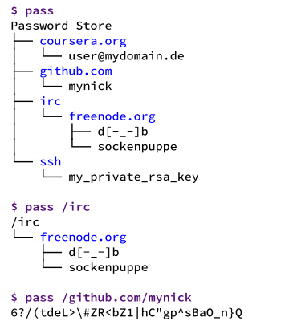
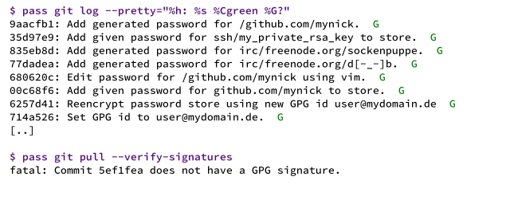

## Kommandozeile: password-store

# Passwörter im Griff
##### "The standard unix password manager" Das behauptet Jason A. Donenfeld, der Autor der Software "password-store" - kurz "pass" genannt.
# 
Das Bundesamt für Sicherheit in der Informationstechnik (BSI [1]) empfiehlt eine Passwortlänge von mindestens 12 Zeichen. Eine Ausnahme besteht bei Verschlüsselungsverfahren wie zum Beispiel WPA und WPA2. Dort sollte das Passwort mindestens 20 Zeichen lang sein. Generell sollte es aus Groß- und Kleinbuchstaben, sowie Sonderzeichen und Ziffern bestehen und sollte nicht in einem Wörterbuch vorkommen.

Restriktiv kann man sagen: "Die gewählten Passwörter sollten eine möglichst gute Gleichverteilung aufweisen" und für jeden Dienst einzigartig sein - Des weiteren sollte ein Passwort regelmäßig geändert werden. Da sind die Möglichkeiten des eigenen Gedächtnis schnell an ihre Grenzen angekommen. Abhilfe für dieses Problem schafft ein Passwortmanager. Dieser speichert die persönlichen Passwörter in einem verschlüsselten Datencontainer, der mit einem Masterpasswort gesichert ist. Somit braucht sich der Anwender nur noch ein einziges Passwort zu merken. Die Mindestempfehlung des BSI kann und sollte dann, ohne größere Gedächtnisleistung, weit übertroffen werden [2].

Unter den zahllosen Passwortmanager sticht einer hervor - password-store (kurz pass genannt [3]). password-store verwendet die bekannten Unix-Werkzeuge (GnuPG [4], Git [5] und PWGen [6]) und wird überwiegend auf der Kommandozeile verwendet. Eine Autovervollständigung steht für die gängigsten Unix-Shells zur Verfügung. Die Passwörter werden in einer Verzeichnisstruktur in dem Standardverzeichnis (»~/.password-store«) gespeichert. 
Dies kann mit der Umgebungsvariable (»PASSWORD_STORE_DIR«) geändert werden. So kann zwischen mehreren Containern gewechselt werden.

## Schloss kodieren
Der Passwortcontainer wird mit einem GnuPG-Schloss versehen. GnuPG unterstützt eine asymmetrische Verschlüsselung, die sehr häufig für eine sichere E-Mail-Kommunikation eingesetzt wird. Um einen Container zu verriegeln muss mindestens ein GnuPG-Schlüsselpaar vorhanden sein. Wobei der private Schlüssel an einem sicheren Ort aufbewahrt werden sollte. Bei Verlust ist ein Zugriff auf die Passwörter nicht mehr möglich; es sei denn der Anwender hat noch einen zweiten Schlüssel kodiert. Ja - unterschiedliche Schlüssel für einen Container sind möglich. Dies erfolgt mit folgendem Aufruf:

```bash
pass init »gpg_id1 gpg_id2«
```
Dies ermöglicht das gemeinsame verwalten und teilen von Passwörtern in einer Projektgruppe. Wenn nicht sowieso schon GnuPG für das verschlüsselen der E-mails unter den Projektteilnehmern verwendet wird, dann sollten sich die Teilnehmer mit dem Konzept des "Web of Trust" und der Schlüsselverwaltung vertraut machen. Denn das verifizieren und signieren der öffentlichen Schlüssel vermeidet störende, aber auch berechtigte Warnmeldungen seitens GnuPG. Neue Projektteilnehmer können auch nachträglich hinzugefügt werden. pass verschlüsselt dann die ausgewählten Kennworteinträge neu. Die Datei ».gpg-id«, im Arbeitsverzeichnis von password-store, listet alle Schlüssel auf mit denen verschlüsselt wurde. Ebenfalls können Unterverzeichnisse mit der Option »-p« separat mit mehreren Schlüsseln kodiert werden. So kann der Zugriff auf einzelne Verzeichnisse auf bestimmte Teilnehmer beschränkt werden.

Anwendung|Beschreibung
 --- | ---
$ pass init user@mydomain.de|(Bitte die Schlüssel ID verwenden)
$ pass init user@mydomain.de user@work.com|Zwei Schlüssel vorhanden (Privat und Arbeit)
$ pass init -p /share/ user@work.com kollege@work.com|Verzeichnis teilen oder einschränken
$ pass git init|Versionsverwaltung nutzen
**Tabelle 1:** Schloss initialisieren. Wie viele Schlüssel sollen es denn sein?

Auch wenn das Teilen der Kennwörter meistens keinen Sinn ergibt, kann diese Option darüber hinaus auch für andere Zwecke genutzt werden. Zum Beispiel könnte ein weiterer Schlüssel für den Einsatz auf einem mobilen Endgerät erzeugt und mit der Option »-p« eingeschränkt werden. Somit wird der Zugriff auf sehr wichtige Passwörter von einem Smartphone aus verweigert.

Mit folgenden Befehl werden die Passwörter unter Versionskontrolle gestellt:

```
pass git init
```

Mehr dazu im Kapitel "Versionsverwaltung nutzen".

## Passwörter organisieren
Die Anwendung ist trivial und lässt viele Organisationsformen zu. Ein neues Passwort wird mit der Option »insert« angelegt (Listing 1 Zeile 1). Die Einträge werden in einer Verzeichnisstruktur auf dem Dateisystem abgelegt. So können die Passwörter nach Protokoll oder Zugehörigkeit mit einem "/" gruppiert werden.

Anfangs ungewohnt ist das mehrzeilige Passwort. Es kann genutzt werden, um neben dem eigentlichen Passwort noch zusätzlich Informationen zu speichern, wie zum Beispiel die Geheime-Frage-Antwort oder andere Hinweise. So kann auch eine Datei als mehrzeiliges Passwort gespeichert werden, zum Beispiel ein RSA-Schlüssel (Listing 1 Zeile 4 und 14). Binäre Zertifikate oder Dateien sollten vorher mit base64 codiert werden.

Die Option »generate« erzeugt mit dem Passwortgenerator PWGen ein Randompasswort. Im Beispiel sind es 42 Zeichen (Listing 1 Zeile 10). Die Entropie ist bei einem Passwortgenerator meistens stärker, als das vom Anwender gewählte Passwort, da die Gleichverteilung neben der Passwortlänge und der Anzahl an möglichen Symbolen eine wichtige Rolle spielt [7].

```bash
01 $ pass insert github.com/mynick
02 Enter password for github.com/mynick:
03
04 $ pass insert --multiline coursera.org/user@mydomain.de
05 press Ctrl+D when finished:
06 foobar
07 Geheime Frage: foo ?
08 Antwort: bar
09
10 $ pass generate irc/freenode.org/d[-_-]b 42
11 The generated password for irc/freenode.org/d[-_-]b is:
12 HalMFxWk/|]d&Rb\X|cxfmwcxTp7CwF@:Ss5A\I|ag
13
14 $ pass insert --multiline ssh/my_private_rsa_key < ~/.ssh/id_rsa
```
**Listing 1:** Ein neues Passwort unter Verschluss stellen.

Die Option »ls« gibt eine Baumstruktur über bereits angelegte Kennwörter auf stdout aus und »show« gibt schließlich den Blick auf das Passwort im Klartext frei. Da diese beiden Optionen am häufigsten verwendet werden, bietet pass ein Alias an, indem der Befehl ohne weitere Optionen ausgeführt wird (Abbildung 1). Weitere Möglichkeiten sind : »cp«, »mv«, »rm«, »edit«, »find«, »grep«.  Diese Befehle sollten dem erfahrenen Anwender bekannt vor kommen.



**Abbildung 1:** Die Passwörter als Baumstruktur.

(»-c«) speichert das Kennwort für einige Sekunden, in der Zwischenablage (Clipboard). Diese Option lässt sich auch mit generate kombinieren, um einem Schulter-Surfen entgegen zu wirken. Bei einem mehrzeiligen Passwort wird nur die erste Zeile in der Zwischenablage gespeichert. Das Kennwort gehört deshalb in die erste Zeile eines mehrzeiligen Passwortes.

## Versionsverwaltung nutzen
Noch bevor die Passwörter unter eine Versionsverwaltung gestellt werden können, sollten noch einige Einstellungen vorgenommen werden. 

```
git config --global user.email "user@mydomain.de"

git config --global user.name "Vorname Nachname"
```

Einen zusätzlichen Schutz bieten die Einstellungen »user.signingkey« und »pass.signcommits«. Damit wird jeder Eintrag mit dem privaten Schlüssel signiert.

```
git  config --global --bool --add pass.signcommits true

git config --global user.signingkey MY_GPG_KEY
```

Die Signatur schützt bei einem Angriff vor Manipulationen. Ein Angreifer kann ein Passwort nicht dechiffrieren, aber er könnte es ohne einer Signatur verändern, eventuell sogar für ein Cross-Site-Scripting ausnutzen - da man davon ausgehen muss, dass dem Angreifer der öffentliche Schlüssel bekannt ist. Wie bei den meisten Sicherheitssystemen, kann der Anwender nicht geschützt werden, wenn das eigene Endgerät von einem Angreifer gekapert wurde. Wobei GnuPG hier ein wenig Schutz bieten kann, durch das verwenden einer Smartcard, auf dem sich der private Schlüssel befindet. Desweitern gibt es schon Ansätze in dem der password-manager komplett auf einer separaten Hardware läuft wie zum Beispiel einem Raspberry Pi Zero [14].

Mit einem zentralen Repository können die Passwörter auf mehreren Endgeräten synchronisiert werden. Dieses wird folgendermaßen auf einem Host erzeugt:

```bash
ssh user@mydomain.de 'git --bare init pw.git'
```

Die Option »bare« erzeugt ein Archiv, das nur zur Synchronisierung und nicht als Arbeitsverzeichnis dient. Dies wird durch die Endung .git gekennzeichnet. Vertrauen voraus gesetzt, kann alternativ auch ein Git-Hosting-Dienst verwendet werden. Allerdings sollte kein öffentlich zugängliches Repository angelegt werden, da die Metadaten nicht verschlüsselt sind. D.h. die Verzeichnisstruktur ist im Klartext lesbar. Um das neu erzeugte Archiv mit einem bereits erzeugten Passwortcontainer zu nutzen, muss es folgendermaßen bekannt gegeben werden:

```bash
pass git remote add origin ssh://user@mydomain.de:$HOME/pw.git
```

und
 
```bash
pass git push --set-upstream --all
```

Jetzt kann das Repository mit den Befehlen (»pass git push«), oder (»pass git pull«) synchronisiert werden. »push« schiebt die lokalen Änderungen an den Host und »pull« zieht den neusten Stand vom Host an das lokale Repository. Im Alltag wird der User kaum mehr als diese beiden Git-Befehle benötigen. Unter der Haube kümmert sich pass um den commit, beim erzeugen eines neuen oder das ändern eines bereits vorhandenen Kennworteintrages. Git erlaubt natürlich auch das verifizieren der Signaturen (Abbildung 2). Und wer sich die Frage stellt: "Wie lange ist dieses Kennwort schon in Gebrauch ?". Der bekommt einen Überblick mit »git log« (Abbildung 3).



**Abbildung 2:** Signaturen verifizieren. Zwei Beispiele.


**Abbildung 3:** Obsoleszenz. Wie lange ist dieses Passwort schon in Gebrauch?

Möchte der Anwender seine Passwörter auf einem neu installiertem System nutzen, dann bietet Ihm Git die Möglichkeit das Archiv zu klonen mit »git clone«. Der Anwender sollte vorher den privaten Schlüssel importieren.

```bash
umask 077; git clone ssh://user@mydomain.de:~/pw.git .password-store
```

## Die kleinen Helfer
Unverzichtbar ist der »gpg-agent«. Dieser verwaltet die GnuPG-Schlüssel und legt fest, wie lange sie vorgehalten werden sollen. Für die Authentifizierung mit SSH sollte ein RSA-Schlüssel angelegt werden, so dass nicht bei jedem Zugriff auf den Host eine Passphrase verwendet werden muss. Dieser lässt sich mit »ssh-agent« oder ebenfalls mit »gpg-agent« verwalten. Auf der Webseite des Projektes [3] findet sich eine Liste der Software, die auf die Struktur von pass aufsetzen. Unter anderem auch eine Erweiterung für den Firefox-Browser [8] oder ein Skript für dmenu [9]. Ebenfalls sind dort einige Migrationswerkzeuge zu finden, mit denen die gängigen Formate - lastpass, keypass oder password gorilla - konvertiert werden können.

## Fazit

"The standard unix password manager". Ob diese Aussage der Wahrheit entspricht, kann hier nicht geklärt werden. Allerdings wurde die Unix-Philosophie [10] von Jason A. Donenfeld verstanden und in pass umgesetzt. Es lässt sich exzellent mit anderen Werkzeugen kombinieren und mit dem Einsatz einer verteilten Versionsverwaltung lassen sich auch umfangreiche Zugangsdaten meistern. Da die Passwörter in einer Unix-Verzeichnisstruktur verwaltet werden, kommt der Komfort nicht zu kurz. Eine Autovervollständigung und die üblichen Befehle zum kopieren, löschen und umbenennen können so genutzt werden. Durch ein "Web of Trust" können Passwörter von mehreren Teilnehmern verwaltet werden. Der größte Schwachpunkt liegt ganz klar in den unverschlüsselten Metadaten. Nur das Passwort selbst ist verschlüsselt.  Die Metadaten, sprich Verzeichnisse, lassen sich dennoch ein wenig, mit der Umgebungsvariablen PASSWORD_STORE_UMASK und einer guten Rechteverwaltung, vor neugierigen Blicken schützen. Des weitern, sei noch das Projekt git-remote-gcrypt [11], zum verschlüsseln eines zentralem Repository, erwähnt. (Quellen und Repository [12]; Mailinglist [13])

[1] BSI: https://www.bsi.bund.de/DE/Home/home_node.html

[2] NIST: http://csrc.nist.gov/publications/drafts/800-118/draft-sp800-118.pdf

[3] passwordstore: http://www.passwordstore.org/

[4] GnuPG: https://gnupg.org/

[5] Git: http://www.git-scm.com/

[6] PwGen: http://sourceforge.net/projects/pwgen/

[7] NIST: http://nvlpubs.nist.gov/nistpubs/SpecialPublications/NIST.SP.800-63-2.pdf

[8] passff: https://github.com/jvenant/passff

[9] dmenu: https://de.wikipedia.org/wiki/Dwm#dmenu

[10] Unix Philisophie: https://de.wikipedia.org/wiki/Unix-Philosophie

[11] git-remote-gcrypt: https://github.com/bluss/git-remote-gcrypt

[12] password-store repository: http://git.zx2c4.com/password-store/

[13] password-store mailing list: http://lists.zx2c4.com/mailman/listinfo/password-store

[14] Hardware password manager: https://hackaday.io/project/9564-rpi-zero-wifi-enabled-hardware-password-manager
